# 🏗️ Stock Sage Architecture Documentation

Comprehensive system architecture and design decisions for Stock Sage platform.

## 🎯 System Overview

Stock Sage is a modern financial analysis platform built with a microservices-inspired architecture, combining real-time data processing, AI-powered analysis, and interactive user interfaces.

### Core Principles

- **Scalability**: Horizontal scaling capabilities
- **Reliability**: Fault-tolerant design with graceful degradation
- **Performance**: Sub-second response times for critical operations
- **Security**: End-to-end encryption and secure authentication
- **Maintainability**: Clean code architecture with comprehensive testing

## 🏛️ High-Level Architecture

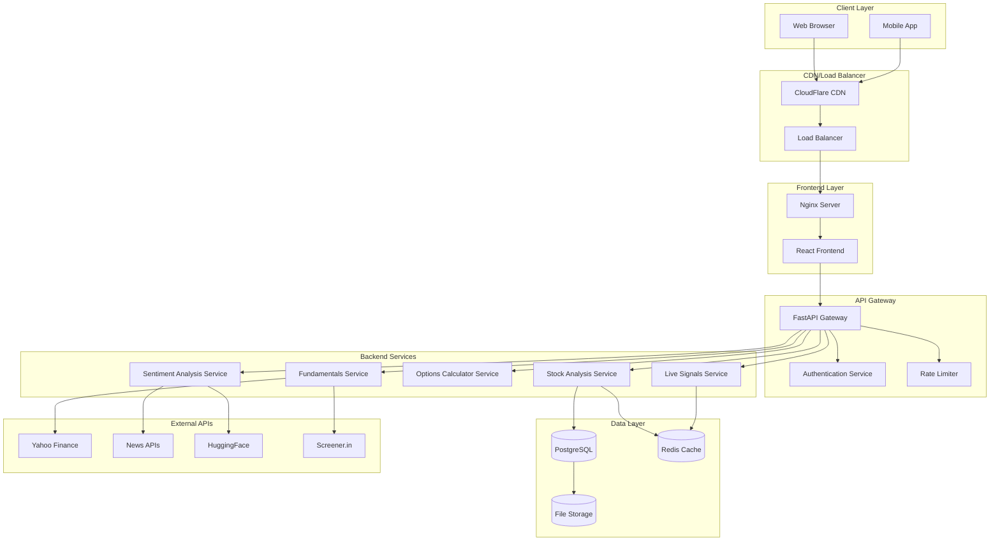

## 🔧 Technology Stack

### Frontend Architecture

```
React 19 Application
├── Components (Functional + Hooks)
├── State Management (Context API + Local State)
├── Routing (React Router v6)
├── UI Framework (Material-UI)
├── HTTP Client (Axios)
├── Build Tool (Vite)
└── Styling (CSS Modules + Responsive Design)
```

### Backend Architecture

```
FastAPI Application
├── API Layer (FastAPI Routers)
├── Business Logic (Service Classes)
├── Data Access (SQLAlchemy ORM)
├── Authentication (JWT + OAuth)
├── Caching (Redis)
├── Background Tasks (Celery)
└── External Integrations (HTTP Clients)
```

### Data Architecture

```
Data Flow
├── Real-time Data (WebSocket + Server-Sent Events)
├── Batch Processing (Scheduled Jobs)
├── Caching Strategy (Multi-layer)
├── Data Validation (Pydantic Models)
└── Data Persistence (PostgreSQL + Redis)
```

## 📊 Component Architecture

### Frontend Component Hierarchy

```
App
├── AuthProvider
│   ├── Intro (Landing Page)
│   └── Home (Main Dashboard)
│       ├── Navbar
│       ├── StockAnalyzer
│       │   ├── MarketSignals
│       │   ├── StockSearch
│       │   ├── AnalysisResults
│       │   └── TechnicalCharts
│       ├── Fundamentals
│       │   ├── FinancialStatements
│       │   ├── RatiosDisplay
│       │   └── ShareholdingPattern
│       └── OptionStrategies
│           ├── StrategySelector
│           ├── PremiumInputs
│           └── PnLTable
```

### Backend Service Architecture

```
FastAPI App
├── Routers
│   ├── auth.py (Authentication)
│   ├── stocks.py (Stock Analysis)
│   ├── fundamentals.py (Financial Data)
│   ├── options.py (Options Trading)
│   └── signals.py (Live Market Data)
├── Services
│   ├── AnalysisService
│   ├── SentimentService
│   ├── OptionsService
│   ├── FundamentalsService
│   └── SignalsService
├── Models
│   ├── User

```

## 🔄 Data Flow Architecture

### Stock Analysis Flow

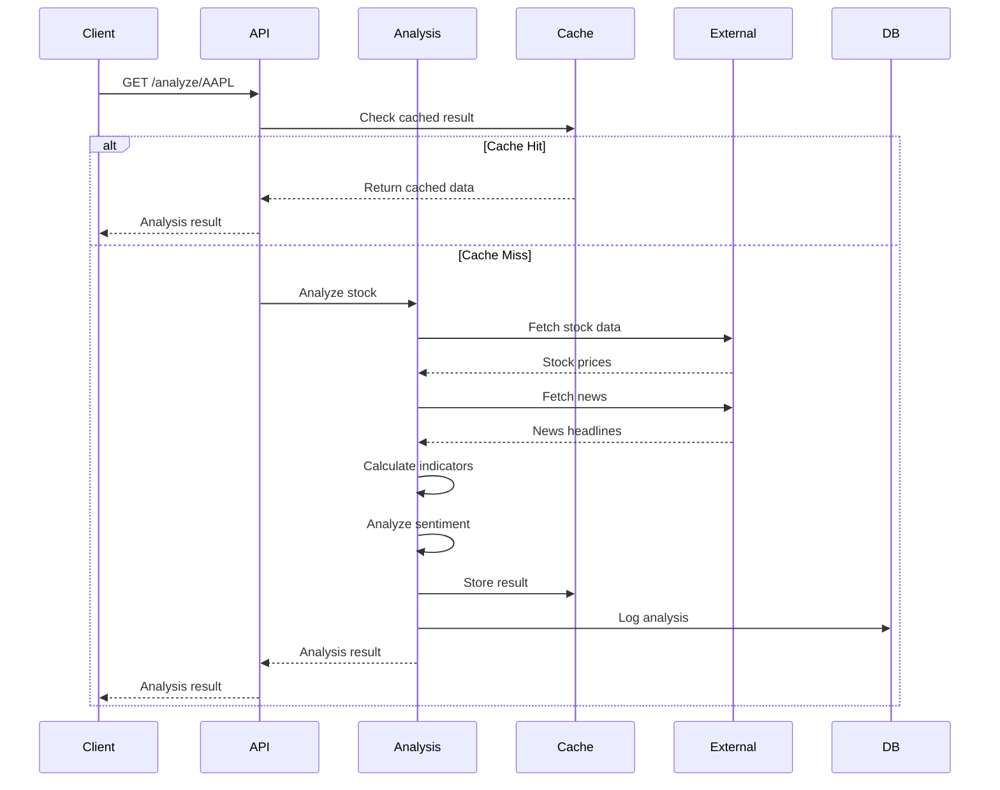

### Real-time Signals Flow

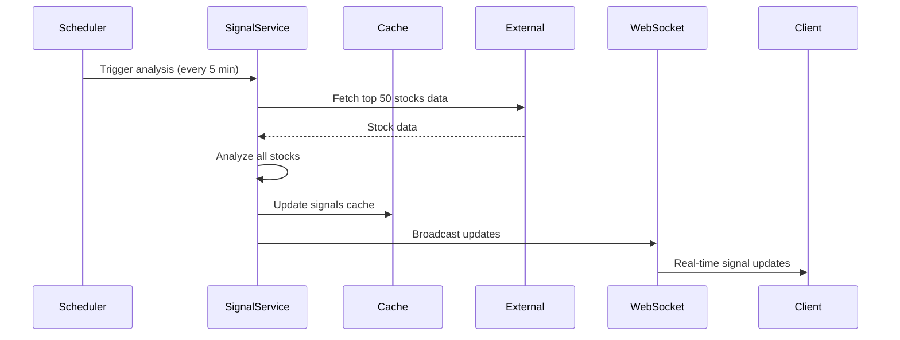

## 🗄️ Database Design

### Entity Relationship Diagram

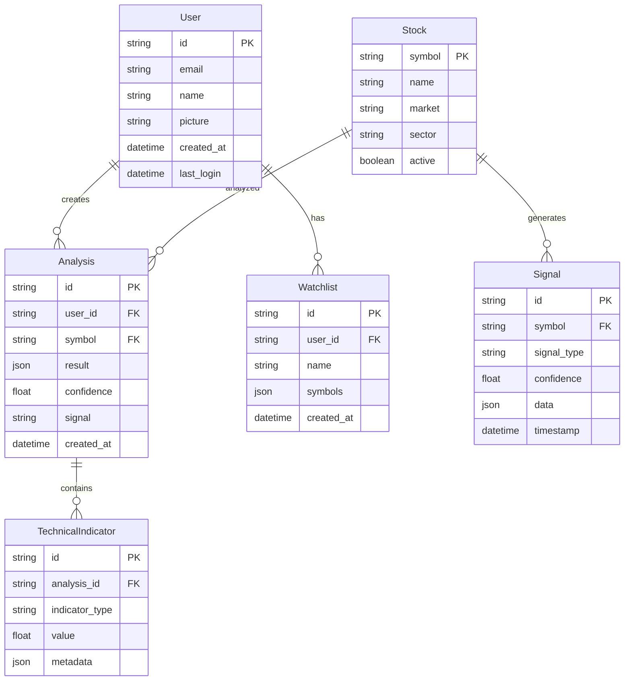

### Current Database Schema (MongoDB)

**Users Collection**

```javascript
{
  _id: ObjectId,
  google_id: String,
  name: String,
  email: String,
  picture: String,
  mobile: String,
  profession: String,
  location: String,
  interests: [String],
  profile_completed: Boolean,
  created_at: Date,
  updated_at: Date
}
```

### Data Processing Architecture

**Current Implementation (In-Memory)**

- **Stock Analysis**: Processed on-demand via FastAPI, no persistence
- **Market Signals**: Cached in-memory for 24 hours, refreshed automatically
- **Technical Indicators**: Calculated real-time using yfinance data
- **Sentiment Analysis**: Real-time processing via HuggingFace API
- **Options Data**: Fetched and calculated on-demand from Yahoo Finance

**Benefits of Current Approach:**

- Fast response times (no database queries for analysis)
- Real-time data (always fresh from external APIs)
- Simplified architecture (fewer moving parts)
- Cost-effective (no database storage costs for analysis data)

### Future Database Schema (PostgreSQL - Planned)

**Users Table**

```sql
CREATE TABLE users (
    id UUID PRIMARY KEY DEFAULT gen_random_uuid(),
    google_id VARCHAR(255) UNIQUE NOT NULL,
    email VARCHAR(255) UNIQUE NOT NULL,
    name VARCHAR(255) NOT NULL,
    picture TEXT,
    mobile VARCHAR(20),
    profession VARCHAR(100),
    location VARCHAR(100),
    interests JSONB,
    profile_completed BOOLEAN DEFAULT false,
    created_at TIMESTAMP DEFAULT CURRENT_TIMESTAMP,
    updated_at TIMESTAMP DEFAULT CURRENT_TIMESTAMP
);
```

**Analysis History Table (Future Enhancement)**

```sql
CREATE TABLE analysis_history (
    id UUID PRIMARY KEY DEFAULT gen_random_uuid(),
    user_id UUID REFERENCES users(id),
    symbol VARCHAR(20) NOT NULL,
    analysis_result JSONB NOT NULL,
    signal VARCHAR(20),
    confidence DECIMAL(5,2),
    created_at TIMESTAMP DEFAULT CURRENT_TIMESTAMP,

    INDEX idx_analysis_user_symbol (user_id, symbol),
    INDEX idx_analysis_created_at (created_at)
);
```

**Market Signals Cache (Future Enhancement)**

```sql
CREATE TABLE market_signals (
    id UUID PRIMARY KEY DEFAULT gen_random_uuid(),
    market VARCHAR(10) NOT NULL, -- 'US' or 'INDIA'
    signal_type VARCHAR(20) NOT NULL, -- 'BUY' or 'SELL'
    signals_data JSONB NOT NULL,
    created_at TIMESTAMP DEFAULT CURRENT_TIMESTAMP,
    expires_at TIMESTAMP NOT NULL,

    INDEX idx_signals_market_type (market, signal_type),
    INDEX idx_signals_expires (expires_at)
);
```

## 🔐 Security Architecture

### Authentication Flow

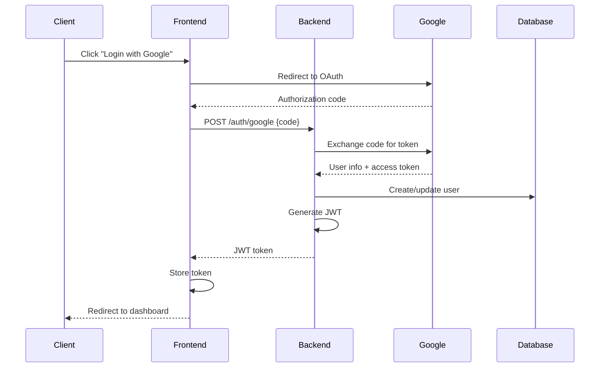

### Security Layers

1. **Transport Security**

   - TLS 1.3 encryption
   - HSTS headers
   - Certificate pinning

2. **Authentication**

   - Google OAuth 2.0
   - JWT tokens with expiration
   - Refresh token rotation

3. **Authorization**

   - Role-based access control
   - Resource-level permissions
   - API rate limiting

4. **Data Protection**
   - Input validation and sanitization
   - SQL injection prevention
   - XSS protection
   - CSRF tokens

## 🚀 Performance Architecture

### Caching Strategy

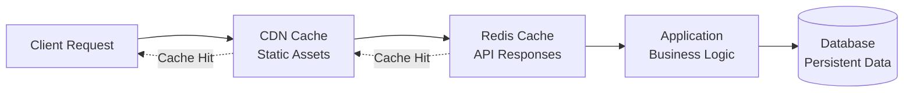

### Cache Layers

1. **CDN Cache** (CloudFlare)

   - Static assets (JS, CSS, images)
   - TTL: 1 year for versioned assets
   - Geographic distribution

2. **Application Cache** (Redis)

   - API responses
   - Stock data: 5 minutes TTL
   - Analysis results: 1 hour TTL
   - User sessions: 24 hours TTL

3. **Database Query Cache**
   - PostgreSQL query cache
   - Materialized views for complex queries
   - Connection pooling

### Performance Optimizations

1. **Frontend**

   - Code splitting and lazy loading
   - Image optimization and WebP format
   - Service worker for offline capability
   - Virtual scrolling for large lists

2. **Backend**

   - Async/await for I/O operations
   - Connection pooling
   - Background task processing
   - Response compression

3. **Database**
   - Proper indexing strategy
   - Query optimization
   - Read replicas for scaling
   - Partitioning for large tables

## 🔄 Scalability Architecture

### Horizontal Scaling Strategy

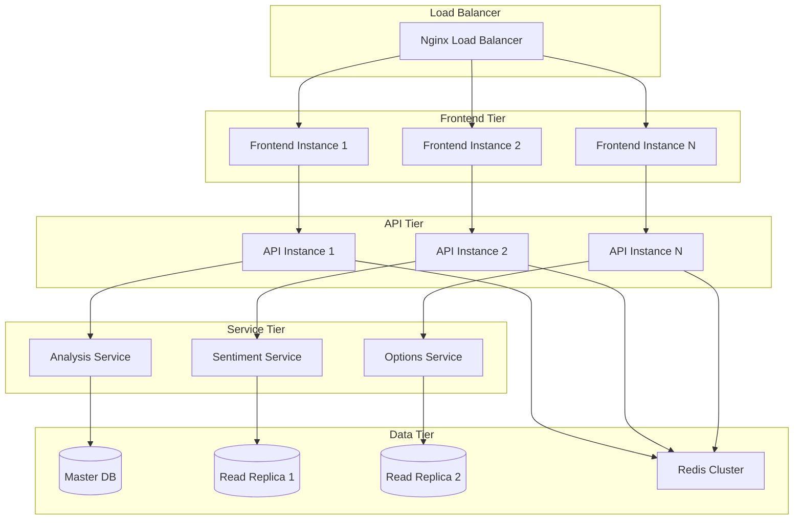

### Auto-scaling Configuration

**Kubernetes HPA**

```yaml
apiVersion: autoscaling/v2
kind: HorizontalPodAutoscaler
metadata:
  name: stocksage-api-hpa
spec:
  scaleTargetRef:
    apiVersion: apps/v1
    kind: Deployment
    name: stocksage-api
  minReplicas: 2
  maxReplicas: 10
  metrics:
    - type: Resource
      resource:
        name: cpu
        target:
          type: Utilization
          averageUtilization: 70
    - type: Resource
      resource:
        name: memory
        target:
          type: Utilization
          averageUtilization: 80
```

## 📊 Monitoring Architecture

### Observability Stack

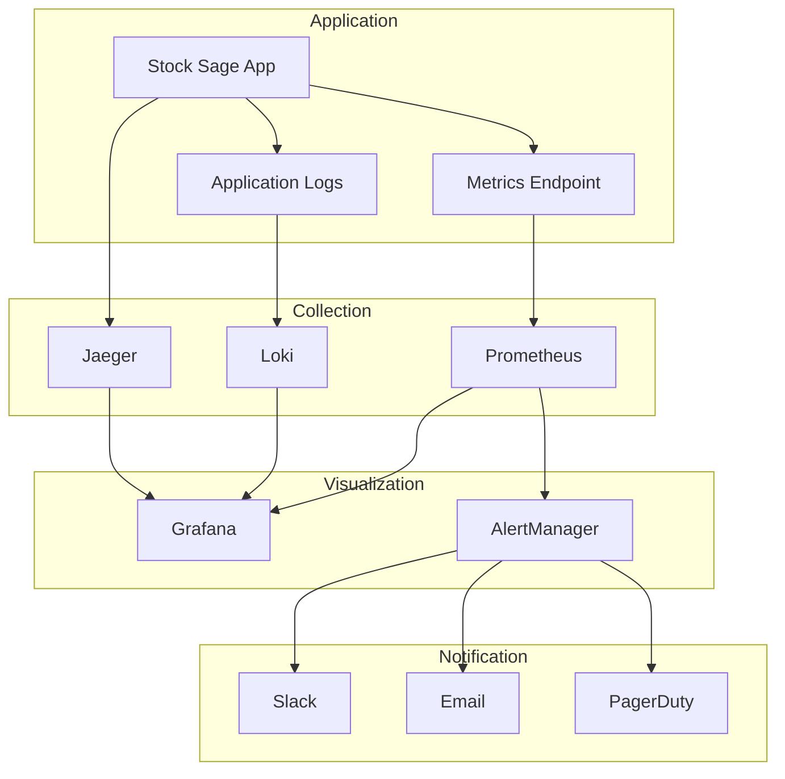

### Key Metrics

1. **Business Metrics**

   - Analysis requests per minute
   - User engagement rates
   - Signal accuracy rates
   - Revenue per user

2. **Technical Metrics**

   - Response time percentiles
   - Error rates by endpoint
   - Database connection pool usage
   - Cache hit rates

3. **Infrastructure Metrics**
   - CPU and memory utilization
   - Network I/O
   - Disk usage
   - Container health

## 🔄 Deployment Architecture

### CI/CD Pipeline

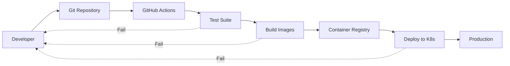

### Environment Strategy

1. **Development**

   - Local Docker Compose
   - Hot reloading enabled
   - Debug logging
   - Mock external APIs

2. **Staging**

   - Production-like environment
   - Real external API integration
   - Performance testing
   - Security scanning

3. **Production**
   - High availability setup
   - Auto-scaling enabled
   - Comprehensive monitoring
   - Disaster recovery ready

## 🎯 Future Architecture Considerations

### Microservices Migration

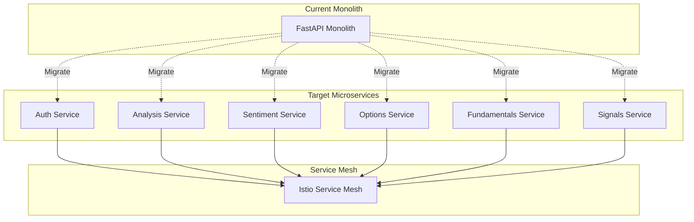

### Event-Driven Architecture

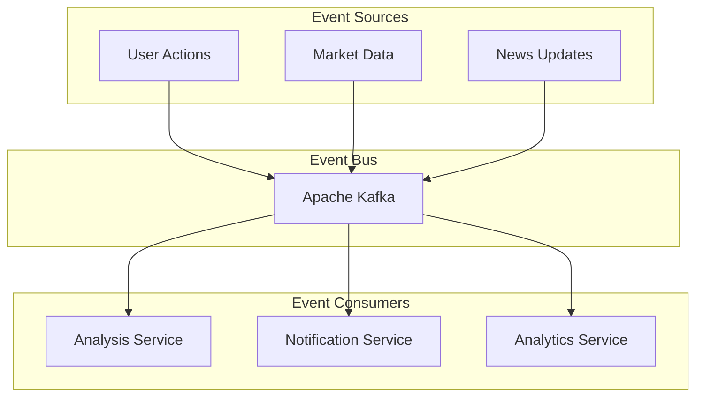

This architecture provides a solid foundation for scaling Stock Sage from a startup MVP to an enterprise-grade financial platform, with clear migration paths and extensibility built in.
